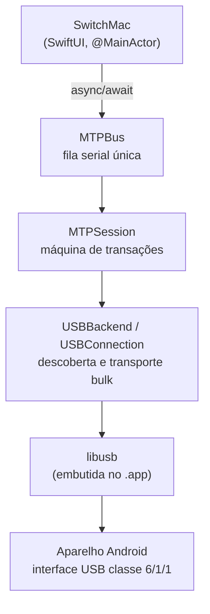
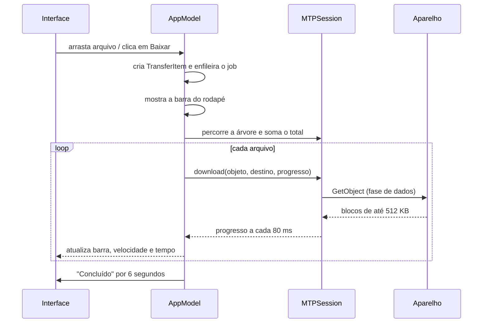

# Arquitetura

## Visão geral

O projeto é dividido em duas metades independentes: uma biblioteca que fala MTP e um
aplicativo SwiftUI que a usa. A biblioteca não importa SwiftUI e pode ser reaproveitada em
outro projeto — um utilitário de linha de comando, por exemplo.



## Camadas

### `Sources/CLibUSB`

Um *module map* de três linhas que expõe a `libusb` do sistema ao Swift. Resolve os
caminhos de cabeçalho e de biblioteca por `pkg-config`, então não há caminho absoluto
codificado em lugar nenhum.

### `Sources/MTPKit`

O protocolo, sem nenhuma dependência de interface gráfica.

| Arquivo | Responsabilidade |
| --- | --- |
| `USB.swift` | Enumera o barramento, identifica a interface MTP, abre e reserva o dispositivo, faz as transferências bulk |
| `MTPBus.swift` | Dona da `libusb` e da única fila serial onde toda a I/O acontece |
| `MTPSession.swift` | Máquina de transações PTP e as operações de alto nível (listar, baixar, enviar, apagar, renomear) |
| `MTPModels.swift` | Os *datasets* do protocolo traduzidos para tipos Swift (`MTPObject`, `MTPStorage`, `MTPDeviceInfo`) |
| `MTPCodes.swift` | Constantes de fio: códigos de operação, de resposta, de formato e de propriedade |
| `ByteStream.swift` | Leitor e escritor *little-endian*, incluindo o formato de string do PTP |
| `MTPError.swift` | Erros com mensagens em português já orientadas à ação |
| `MTPLog.swift` | Buffer circular de diagnóstico e o sinalizador de cancelamento |

### `Sources/SwitchMac`

O aplicativo.

| Arquivo | Responsabilidade |
| --- | --- |
| `AppModel.swift` | Estado observável, máquina de conexão, navegação e fila de transferências |
| `ContentView.swift` | Layout de duas colunas, barra de ferramentas, folhas modais |
| `SidebarView.swift` | Estado do aparelho e lista de armazenamentos |
| `BrowserView.swift` | Tabela de arquivos, arrastar e soltar nos dois sentidos, menu de contexto |
| `TransferBar.swift` | Barra de progresso do rodapé |
| `TransfersPanel.swift` | Histórico de transferências |
| `WelcomeView.swift` | Tela de conexão com instruções e ações de recuperação |
| `Sheets.swift` | Folha de nome (criar/renomear) e janela de diagnóstico |
| `InterfaceRelease.swift` | Detecta e encerra os serviços do macOS que reservam a interface |
| `Support.swift` | Formatação de bytes, datas, durações e ícones de arquivo |
| `DemoData.swift` | Dados fictícios do modo `--demo` |
| `Probe.swift` | Sondagem do modo `--probe`, para investigar um aparelho específico |

## Decisões de projeto

### Por que não usar a `libmtp`

A `libmtp` resolveria o protocolo, mas traria uma dependência a mais para embutir, uma API
em C desconfortável de usar a partir do Swift e pouco controle sobre *streaming* e
progresso. O protocolo MTP, do lado do Android, é o `MtpServer` do AOSP — uniforme e bem
documentado. Implementá-lo direto sobre a `libusb` deu controle total sobre progresso,
cancelamento e transferência em *streaming*, com uma dependência só.

### Uma fila serial, sempre

MTP é estritamente sequencial: uma transação por vez, em uma sessão só. Serializar tudo em
`MTPBus.queue` não custa desempenho — o protocolo não permitiria paralelismo de qualquer
forma — e elimina uma classe inteira de bugs de concorrência. A interface conversa com essa
fila por `async/await`, então a thread principal nunca bloqueia.

A consequência visível: enquanto uma transferência grande está em andamento, navegar em
outra pasta espera ela terminar. É uma limitação do MTP, não do app.

### Cancelar reabre a conexão

Interromper no meio da fase de dados deixa bytes pendentes no *endpoint*, e a sessão perde
o sincronismo. Drenar tudo pode significar ler gigabytes só para jogar fora. Reabrir a
interface e a sessão custa cerca de 200 ms e sempre funciona, então é o que
`MTPSession.recover()` faz.

### Listagem progressiva

O MTP não tem uma operação que devolva nome, tamanho e data de uma pasta inteira de uma vez
de forma confiável em todos os aparelhos — o `GetObjectPropList` tem restrições que variam.
O app usa o caminho seguro: `GetObjectHandles` seguido de um `GetObjectInfo` por item.

Para que uma pasta com milhares de arquivos não pareça travada, os resultados sobem para a
interface em lotes de 64 itens, e um contador de geração descarta lotes de uma navegação
que já foi abandonada.

### Detecção por polling

A `libusb` tem *hotplug*, mas exigiria um laço de eventos próprio. Uma varredura a cada dois
segundos é mais simples, mais previsível e imperceptível. As strings USB de cada aparelho
são lidas uma única vez e ficam em cache, porque lê-las exige abrir o dispositivo.

### Instância única

Duas cópias do app abertas brigariam pela mesma interface USB e a segunda receberia "acesso
negado". `AppDelegate.applicationWillFinishLaunching` detecta uma instância anterior, traz
a janela dela para a frente e encerra a nova.

## Fluxo de uma transferência



A fila é processada por uma única `Task`; jobs enfileirados aparecem como "na fila" na
barra e no painel de transferências.

## Limitações conhecidas

- **Um aparelho por vez** — o primeiro encontrado em modo MTP.
- **Uma transferência por vez**, por causa da sessão MTP única.
- **Navegar durante uma transferência grande espera** a transferência terminar.
- **Renomear depende de `SetObjectPropValue`**; aparelhos antigos que não implementam a
  operação recebem um aviso claro em vez de falhar em silêncio.
- **Sem retomada de transferência interrompida** — um download cancelado recomeça do zero.
- **Nintendo Switch com firmware de fábrica é somente leitura**: o console expõe MTP apenas
  para o álbum de capturas. Com um *responder* homebrew como o **DBI**, porém, o acesso é
  completo — leitura e escrita no cartão SD e nas partições NAND (veja
  [Aparelhos verificados](#aparelhos-verificados)).

## Aparelhos verificados

### Nintendo Switch com DBI (`057e:201d`)

Testado de ponta a ponta. O DBI se identifica como `Nintendo / Switch / 22.5.0` e expõe
oito armazenamentos virtuais: cartão SD, NAND USER, NAND SYSTEM, jogos instalados, dois
destinos de instalação, saves e álbum.

Operações que ele anuncia em `GetDeviceInfo`:

```
0x1001 0x1002 0x1003 0x1004 0x1005 0x1007 0x1008 0x1009 0x100B 0x100C 0x100D
0x1014 0x1015 0x1016 0x1019 0x101B 0x95C1 0x95C2 0x95C3 0x95C4 0x95C5
0x9801 0x9802 0x9803 0x9804 0x9805 0x9808
```

Ou seja: leitura, escrita (`SendObjectInfo` + `SendObject`), remoção, renomear
(`SetObjectPropValue`) e leitura parcial de 64 bits (`GetPartialObject64`).

Particularidades observadas:

- Os identificadores de objeto seguem o padrão `0xSSNNNNNN`, com o índice do armazenamento
  no byte alto — mas o `parent` da raiz vem como o próprio ID do armazenamento, e não como
  `0`. O app não depende desse campo para navegar, então não faz diferença.
- Não há datas: tudo volta como época zero (31/12/1969 no fuso local).
- `GetObjectHandles` com `storage = 0xFFFFFFFF` responde `InvalidStorageID` (`0x2008`);
  é preciso informar o armazenamento específico, que é o que o app faz.
